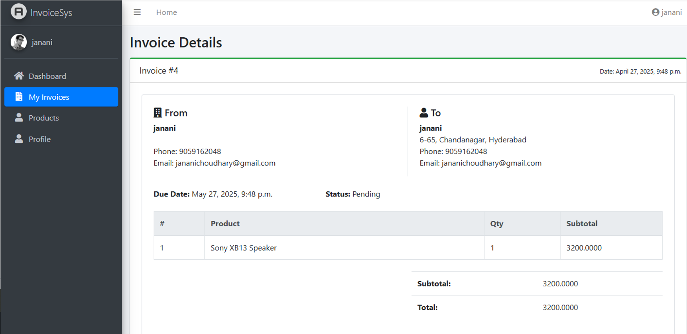

# Automated Invoice Generation System

## Overview
This project is a web-based invoice generation system built using Python and Django. It allows users to create, manage, and track invoices efficiently.

## Features
- Create and manage invoices
- View detailed invoice information
- Dashboard to track all invoices
- Store invoice data in database
- Clean and user-friendly UI

## Tech Stack
- Python
- Django
- SQLite
- HTML, CSS, Bootstrap

## How to Run
1. Clone the repository
2. Navigate to project folder
3. Install dependencies:
   pip install -r requirements.txt
4. Run server:
   python manage.py runserver
5. Open in browser:
   http://127.0.0.1:8000/

## Screenshots

### Invoice Details

### Invoice Dashboard

